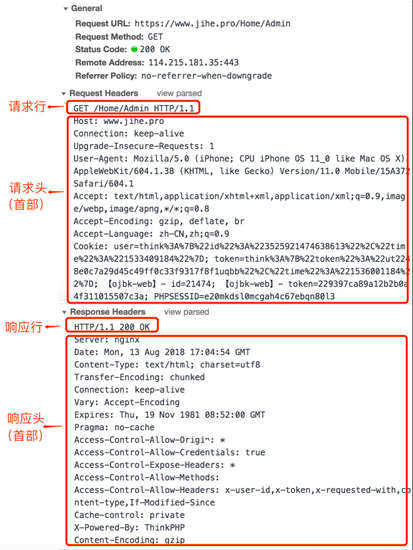

## JavaScript

#### 1、前端性能优化
  - manifest静态资源缓存，如果已有缓存资源，会与服务器最后修改时间对比，一致则返回304，直接使用已缓存资源
    - 优势：
      > - 离线浏览 - 用户可在应用离线时使用它们
      > - 速度 - 已缓存资源加载得更快
      > - 减少服务器负载 - 浏览器将只从服务器下载更新过或更改过的资源  

    - 实现原理
      ```html
        <html manifest="manifest.appcache"></html>
      ```
      ```js
        // 设置后面的文件为缓存
        CACHE:
        /static/js/app.js

        // 置后面的文件为不缓存（无法设置自身页面）
        NETWORK:

        // 置后面的文件错误或不存在的时候使用另一个文件(404页面)
        FALLBACK:
        /static/errpage.html

        // 可以设置fast或prefer-online两种模式
        SETTINGS:
      ```
  - 缓存部分数据，尽可能减少http请求，合理使用http缓存
    - 强缓存（200 from cache）时，浏览器如果判断本地缓存未过期，就直接使用，无需发起http请求
      > 设置请求头Cache-Control/Max-Age

    - 协商缓存（304）时，浏览器会向服务端发起http请求，然后服务端告诉浏览器文件未改变，让浏览器使用本地缓存
      > If-None-Match/E-tag

  - Service Worker
    - 介于服务器和网页之间的拦截器，能够拦截进出的HTTP 请求，从而完全控制你的网站。实现离线缓存。
    - 缓存资源，能够创建有效的离线体验，拦截网络请求并基于网络是否可用以及更新的资源是否驻留在服务器上来采取适当的动作，提高二次访问首屏速度，也为创建PWA（桌面WEB）的实现提供服务。
    - 特点：
      - 在页面中注册并安装成功后，运行于浏览器后台，不受页面刷新的影响，可以监听 - 和截拦作用域范围内所有页面的 HTTP 请求。
      - 网站必须使用 HTTPS。除了使用本地开发环境调试时(如域名使用 localhost)
      - 运行于浏览器后台，可以控制打开的作用域范围下所有的页面请求
      - 单独的作用域范围，单独的运行环境和执行线程
      - 不能操作页面 DOM。但可以通过事件机制来处理
      - 事件驱动型服务线程

  - 尽可能少使用setInterval(会产生阻塞队列，使用setTimeout递归来模拟实现setInterval功能)、watch（变量不会被垃圾回收机制回收）等观察者模式的方法，避免滥用async、await异步函数（会产生阻塞队列）

  - 使用Web Workers分担部分计算密集型或高延迟的任务，主线程不会被阻塞或拖慢。
    ```javascript
      // 主线程
      let worker = new Worker('worker.js')
      worker.postMessage({ method: 'echo', args: ['Work'] }) // 主线程向worker线程发送数据

      worker.onmessage = function (event) {
        // 主线程监听worker线程返回数据
        console.log('Received message ' + event.data)
        worker.postMessage('Work done!')
      }

      // 错误处理
      worker.onerror(function (event) {
        console.log(event)
      })

      worker.terminate()  // 关闭worker线程
      ```
      ```javascript
      // worker 线程
      // 子线程监听主线程传输的数据
      self.addEventListener('message', function (e) {
        self.postMessage('You said: ' + e.data) // 向主线程发送数据
      }, false)

      self.close() // 关闭自身线程

      self.importScripts('script1.js') // 子线程加载其他js脚本
    ```
  - 组件、模块通过懒加载或按需加载减少首屏加载时长（服务端渲染ssr也可以减少首屏渲染白屏时长）

  - 异步子组件优化页面加载时长
  ```javascript
    Vue.component(
      'async-webpack-example',
      // 这个 `import` 函数会返回一个 `Promise` 对象。
      () => import('./my-async-component')
    )
  ```
  - Object.freeze() 对象冻结减少CPU（observer）开销 [(源)](https://juejin.im/post/5b960fcae51d450e9d645c5f)
    > Object.freeze() 可以冻结一个对象，冻结之后不能向这个对象添加新的属性，不能修改其已有属性的值，不能删除已有属性，以及不能修改该对象已有属性的可枚举性、可配置性、可写性。该方法返回被冻结的对象。

    > 当你把一个普通的 JavaScript 对象传给 Vue 实例的  data  选项，Vue 将遍历此对象所有的属性，并使用  Object.defineProperty  把这些属性全部转为 getter/setter，这些 getter/setter 对用户来说是不可见的，但是在内部它们让 Vue 追踪依赖，在属性被访问和修改时通知变化。

    > Vue 在遇到像 Object.freeze() 这样被设置为不可配置之后的对象属性时，不会为对象加上 setter getter 等数据劫持的方法。

  - 减少重绘和回流，减少dom操作，使用className代替直接使用style编写样式、减少class选择器的层级嵌套、减少元素标签的使用

  - 图片、图标应先压缩合并，部署其他前静态资源前也应先压缩，使用CDN优化加载效率、
上传图片等资源压缩后再上传
    - CDN 静态资源尽量使用 CDN 加载，由于浏览器对于单个域名有并发请求上限，可以考虑使用多个 CDN 域名。

  - 图片懒加载 / 图片预加载
    - 懒加载原理：先加载一张白块或低品质图片，当页面停止在可视范围后加载真实图片，滚动事件通过函数节流来控制
      ```html
        
        <!--
          src 中为白块或低品质图片
          original 中为真实图片
          在可视范围时使用original中的真实图片地址替换src中的地址
         -->
      ```

#### 2、vue等单页项目 首屏加载白屏是怎么处理的
  - 交互设计
    - 给个loading动画，过度资源加载过程
    - 设计占位图和loading，页面加载完成后替换
    - 一屏可视组件优先加载

  - 代码优化
    - 考虑对于页面的组件异步加载
    - webpack打包优化，减小打包文件体积大小
    - vuejs路由的懒加载，减少首屏加载资源
    - 配置vue-cli，利用webpack插件完成模板预加载
    - 考虑服务器渲染首屏骨架页面，或者使用服务器渲染策略ssr
    - 首页数据初始化和js包同时加载
    - js拆包

#### 3、node给前端带来了哪些变化（应用场景）
  - 使用node开发后端
  - react、vue等前端框架辅助开发(webpack)
  - 桌面应用、插件等（atom）

#### 4、typescript 和 JavaScript 的区别
  - typescript 是静态的强类型语言
    - 增加了静态类型、类（面向对象）、模块、接口和类型注解（变量类别必须在头部使用注解定义才可使用）
    - 静态类型化是一种功能，可以在开发人员编写脚本过程中即可检测错误
    - 可用于开发大型的应用(deno等)

  - JavaScript 是动态的弱类型语言
    - 不支持面向对象语言所具有的继承和重载功能
    - 变量可以在任意地方定义和修改，并且会产生变量提升的问题、优势也是弱势、合作开发容易产出不可预料的错误
    - 没有类的概念，es6中的class仍是使用prototype来实现继承

#### 5、闭包
  - 指一个函数内部返回另一个函数，而这个内部函数使用了父级的变量，在这个函数被调用时即产生了闭包。
  - 形成闭包的函数的内部变量不会被垃圾回收机制所销毁

#### 6、JavaScript实现继承的几种方式
```JavaScript
  // 构造函数
  function People (name) {
    // 构造属性
    this.name = name
    this.sleep = function () {
      console.log(name + ':sleep')
    }
  }
  // 原型
  People.prototype.eat = function (food) {
    console.log(food)
  }

  1、原型链继承
  function People1 () {}
  People1.prototype = new People()
  // 方法重载
  People1.prototype.eat = function (food) {
    console.log(food)
  }

  2、构造继承（使用父级的构造函数来增加子类属性）
  function People2 () {
    People.call(this)
    this.like = 'cooding'
  }

  3、实例继承
  function People3 (name) {
    let people = new People()
    people.name = name || 'Tom'
    return people
  }

  4、拷贝继承
  function People4 (name) {
    let people = new People()
    for (let key in people) {
      People4.prototype[key] = people[key]
    }
  }

  5、组合继承 ****
  function People5 (name) {
    People.call(this)
  }
  People5.prototype = new People()
  // 需要修复构造函数指向
  People5.prototype.constructor = People5

  6、class继承
  class People6 extends People {
    constructor(name) {
      super(name)
    }
  }
```

#### 7、webpack理解
  - webpack 是模块化项目构建工具，通过Loader转换文件，通过Plugin注入钩子，最后输出由多个模块组合成的文件。符合生产环境部署的前端资源。

  - 与其他构建工具（gulp等）的区别：
    - gulp
      - gulp 是流程化项目构建工具，通过配置一系列的task，定义task处理的事务（例如文件压缩合并、雪碧图、启动server、版本控制等），然后定义执行顺序，来让gulp执行这些task，从而构建项目的整个前端开发流程。
      - gulp工作方式：在一个配置文件中，指明对某些文件进行类似编译，组合，压缩等任务的具体步骤，这个工具之后可以自动替你完成这些任务。
    - webpack
      - 更注重强调模块化开发，把你的项目当做一个整体，通过一个给定的主文件（如：index.js），Webpack将从这个文件开始找到你的项目的所有依赖文件，使用loaders处理它们，最后打包为一个浏览器可识别的JavaScript文件。


  - loader 的机制
    - 用来加载处理各种形式的资源，本质上是一个函数，接受文件作为参数，返回转化后的结构。
    - 用于对模块的源代码进行转换。其类似于其他构建工具中“任务(task)”，并提供了处理前端构建步骤的强大方法

    ```js
      rules: [
        {
          test: /\.vue/,
          use: [
            {
              loader: 'vue-loader',
              include: [resolve('src')],
              options: {
                ...
              }
            }
          ]
        }
      ]
    ```
  - plugin
    - 一个JavaScript函数或者class（ES6语法）。
    - 在它的原型上定义一个apply方法。
    - 指定挂载的webpack事件钩子。
    - 处理webpack内部实例的特定数据。
    - 功能完成后调用webpack提供的回调。

  ```js
    // Compiler对象代表了完整的 webpack 环境配置。
    // 这个对象在启动 webpack 时被一次性建立，并配置好所有可操作的设置，包括 options，loader 和 plugin。
    import { Compiler } from 'webpack'

    // 创建一个新的 compiler 实例
    const compiler = new Compiler()

    compiler.options = {...} // 填充所有必备的 options 选项

    class PluginDemo {
      apply (compiler) {
        compiler.plugin('emit', function(compilation, callback) {
          // 执行一些异步……
          setTimeout(function() {
            console.log('异步运行完成...');
            callback()
          }, 1000)
        })
      }
    }
  ```

  - webpack 常见的事件钩子


  |钩子|作用|参数|类型|
  |---|---|---|---|
  | after-plugins  | 设置完一组初始化插件之后 | compiler | sync |
  | after-resolvers| 设置完resolvers之后    | compiler | sync |
  | run	           | 在读取记录之前	       | compiler |	async |
  | compile        | 在创建新compilation之前|	compilationParams |	sync             |
  | compilation    | compilation创建完成   |	compilation |	sync|
  | emit           | 在生成资源并输出到目录之前|	compilation |	async|
  | after-emit     | 在生成资源并输出到目录之后|	compilation |	async|
  | done           | 完成编译|	stats |	sync |

  - loader 和 plugin 的区别
    - loader是用来对模块的源代码进行转换，而插件（plugin）目的在于解决 loader 无法实现的其他事。
    - plugin可以在任何阶段调用，能够跨Loader进一步加工Loader的输出，在构建运行期间，触发事件，执行预先注册的回调，使用compilation对象做一些更底层的事情。


#### 8、不同域名之间怎么实现数据通信（纯前端）
  - window.open页面通信
    ```javascript
      const childPage = window.open('child.html', 'child')

      childPage.onload = () => {
        childPage.postMessage('hello', location.origin)
      }

      // child.html
      window.onmessage = evt => {
        // evt.data
      }
      //缺点是只能与自己打开的页面完成通讯，应用面相对较窄；但优点是在跨域场景中依然可以使用该方案。
    ```

  - iframe 子页面向父页面发送信息
    ```javascript
      // parent.html
      window.addEventListener('message', function (e) {
        // 通过origin属性判断消息来源地址
        console.log(e.data)  
      }, false)

      // child.html
      var ifr = window.parent  //获取父窗体
      ifr.postMessage('这是传递给a.html的信息', location.origin);
    ```
  - localStorage （跨浏览器无效）
  - cookie （要求domain域名一致，或子域名相同）
  - webSocket (需要后端来维护)
    > 它实现了浏览器与服务器全双工通信，同时允许跨域通讯

    ```javascript
      //新建一个WebSocket对象，
      var ws = new WebSocket('ws://127.0.0.1:8080/url');
      //注意服务器端的协议必须为“ws://”或“wss://”，其中ws开头是普通的websocket连接，wss是安全的websocket连接，类似于https。
      // 连接被打开时调用
      ws.onopen = function () {};

      // 在出现错误时调用，例如在连接断掉时
      ws.onerror = function (e) {};

      // 在连接被关闭时调用
      ws.onclose = function () {};

      ws.onmessage = function(msg) {
        // 在服务器端向客户端发送消息时调用
        // msg.data包含了消息
      };
      // 这里是如何给服务器端发送一些数据
      ws.send('some data');
      // 关闭套接口
      ws.close();
    ```

  - JSONP跨域通信
    > 原理：主要是利用script标签不受同源策略限制的特性

    ```javascript
    <script type="text/javascript">
      // 创建script标签
      var url = 'http://localhost.com/api?id=1&callback=jsonpCb'
      var _script = document.createElement('script')
      _script.setAttribute('src', url)
      document.getElementsByTagName('head')[0].appendChild(_script)

      // script标签挂载后回调
      function jsonpCb (data) {
        console.log('name:' + data.name)
      }
    </script>
    ```

#### 9、canvas 和 svg 的区别
  - canvas 是画布，通过JavaScript来绘制，可绘制2D、3D图形，依赖分辨率 适合做动画
  - svg 是矢量图形，是xml的一种元素标签，可以通过操作dom元素的方法来控制，不会根据大小尺寸的变化而影响分辨率

#### 10、事件冒泡和事件捕获 以及 事件委托
  - 事件冒泡：事件开始最具体的元素（文档中嵌套层次最深的那个节点）接收，然后逐级向上传播到根节点。
  - 事件捕获：接收事件的顺序为根节点到具体的节点。

  - DOM2级事件处理程序
    - addEventListener()和removeEventListener()。
    它们接受三个参数：处理的事件名称，事件处理程序，Boolean。true则为在事件捕获阶段处理，false为在事件冒泡阶段处理。

    ```javascript
      function handler () {
        alert('click')
      }
      dom.addEventListener('click', handler, false | true)
    ```

  - 事件委托
    - 利用事件冒泡，只指定一个事件处理程序，就可以管理某一类型的所有事件。例如 ul li点击事件
    ```html
      <ul id="ul">
        <li>111</li>
        <li>222</li>
        <li>333</li>
        <li>444</li>
      </ul>
    ```
    ```javascript
      let ul = document.getElementById('ul')
      ul.onclick = function (e) {
        e = e | window.event
        if (e.target.tagName.toLowerCase() === 'li') {
          console.log(e.target.innerHtml)
        }
      }
    ```
    - 优点
      - 可以大量节省内存占用，减少事件注册。
      - 可以实现当新增子对象时，无需再对其进行事件绑定，对于动态内容部分尤为合适
    - 缺点：事件代理的常用应用应该仅限于上述需求，如果把所有事件都用事件代理，可能会出现事件误判。即本不该被触发的事件被绑定上了事件。

#### 11、函数去抖 和 函数节流（[源](https://www.jianshu.com/p/0dbe40b7c1cf)）
  - 函数去抖：当事件触发之后，必须等待某一个时间之后，回调函数才会执行，假若再等待的时间内，事件又触发了则等待时间刷新。
    ```javascript
      var debounce = function(delay, cb) {
        var timer;
        return function() {
          if (timer) clearTimeout(timer);
          timer = setTimeout(function() {
            cb();
          }, delay);
        }
      }
    ```

  - 函数节流：当事件触发之后，按照一个固定时间周期执行。
    ```javascript
      var throttle = function(delay, cb) {
      var startTime = Date.now();
        return function() {
          var currTime = Date.now();
          if (currTime - startTime > delay) {
              cb();
              startTime = currTime;
          } else {
            timer = setTimeout(cb , delay);
          }
        }
      }
    ```
  - demo: window.resize或window.scroll
    - 使用函数去抖后，会在停止resize事件后等待某时间触发回调
    - 使用函数节流，会导致resize事件固定时间周期触发一次事件回调


#### 12、this关键字
  - this是JavaScript的一个关键字，通常情况下指代调用它的那个对象，随着使用的场合不同，它的值会发生改变。
    - 在浏览器中默认情况下指代window对象
    - 在自执行函数中默认指代window对象
    - 在一般函数中默认指代函数本身
    - 通过new关键字生成的实例对象，this会指向实例本身
  - 通过使用call、apply、bind可以手动改变this的指代对象

  - call、apply、bind的主要区别 传参的方式不一样
    ```js
      let obj = { name: 'xm' }
      function test (argu, argu2) {
        let name = 'tt'
        console.log(this.name + ':' + argu + '、' + argu2)
      }
      test.call(obj, 'sleep', 'coding')
      test.apply(obj, ['sleep', 'coding'])

      // bind 返回的是一个函数
      // 用法1：
      let test1 = test.bind(obj)
      test1('sleep', 'coding')
      // 用法2：
      let test2 = test.bind(obj, 'sleep', 'coding')
      test2()
    ```

#### 13、原型、原型链
  - 原型对象：即指的是prototype对象
    - 通过对象直接量创建的对象Object.prototype作为他的原型
    - 通过new创建的对象使用构造函数的prototype对象作为原型
    - 通过Object.create()创建的对象使用第一个参数作为原型，也可以是null
  - 原型链：每个对象都有一个指向它的原型对象（prototype）的内部链接(__proto__ 原型指针)。这个原型对象又有自己的原型，直到某个对象的原型为 null 为止（ Object.prototype.__proto__ ），组成这条链的最后一环。这种一级一级的链结构就称为原型链（prototype chain）。

  ```js
    function Person () {}
    let person1 = new Person()

    Object.prototype.__proto__ // null
    Function.prototype.__proto__ === Object.prototype
    Function.__proto__ === Function.prototype // 特例 唯一一个原型指针指向本身原型对象
    Object.__proto__ === Function.prototype // Object、Date等 属于构造函数
    Person.__proto__ === Function.prototype
    person1.__proto__ === Person.prototype
  ```

#### 14、数据双向绑定实现原理 [参考](https://segmentfault.com/a/1190000006599500)
  - vue v-model 使用<font color="#d27377">数据劫持(defindeProperty)</font>结合<font color="#d27377">发布者-订阅者模式</font>实现  
  - [实现代码](./vue双向数据绑定.js)
  - 原理图
  

#### 15、浏览器攻击（XSS、CSRF）[来源](https://mp.weixin.qq.com/s/sjy-Kul5y0Wj-HJwQn7gBA)
    - XSS 跨站脚本注入攻击
      - 原理：服务端过于信任客户端提交的数据，没有对提交的信息进行过滤
      - 解决：
        1. 输入输出内容检查并过滤
        2. Cookie中设置HttpOnly (设置HttpOnly的Cookie通过js脚本将无法读取到)

    - CSRF 跨站请求伪造(挟持)
      - 要求：
        1. 登录受信任网站A，并在本地生成Cookie。
        2. 在不登出A的情况下，访问危险网站B。B网站拿到A网站的cookie，并发送请求。
      - 解决：
        1. 验证码
        2. 请求验证Referer来源
        3. token验证（jwt）

#### 16、http协议原理
  - http (Hyper Text Transfer Protocol) 超文本传输协议
    - http请求过程
      - DNS解析 -> 建立TCP连接 -> 发送请求头和请求行 -> 发送请求体 -> 等待服务器返回首字节(响应头) -> 接收数据
    - HTTP 标准端口是80 ，而 HTTPS 的标准端口是443
    - http报文
      - 请求报文包含三部分：
        - 请求行：包含请求方法、URI、HTTP版本信息
        - 请求头（首部字段、header）
        - 请求体（具体数据）
      - 响应报文包含三部分：
        - 状态行：包含HTTP版本、状态码、状态码的原因短语
        - 响应头（首部字段、header）
        - 响应体

      
    - [GET和POST请求的区别](./http请求原理.md)
  -

  - TCP三次握手
    - Client端 向 Server端 发送连接请求报文 SYN
    - Server端 向 Client端 发送连接请求确认报文 ACK + SYN
    - Client端 想 Server端 发送连接确认报文 ACK

  - TCP四次挥手

  - https 是以安全为目的的http通道，即http安全版，基于SSL加密和CA身份认证，SSL使用非对称加密进行握手（通信过程中告知后续使用的对称加密密钥），使用对称加密进行后续通信
    - 加密算法
      - 非对称加密（RSA加密）运用于握手阶段
        > - 即使用公钥加密，使用对应的私钥解密
        > - 算法强度复杂、安全性依赖于算法，两种密钥，其中一个是公开的，一种是私有的，安全性高
        > - 缺点：由于其算法复杂，加密解密速度效率低

      - 对称加密 运用于会话阶段
        > - 即使用主密钥加密，使用主密钥解密
        > - 优点：算法公开、计算量小、加密速度快、加密效率高、可逆
        > - 缺点：双方使用相同钥匙，安全性得不到保证

    - SSL加密原理[参考](https://blog.csdn.net/chenxu6/article/details/53290858)
      - 客户端 发起请求，将版本信息、加密套件可选列表，压缩算法可选列表、随机数(random_C)、扩展字段等信息发送给服务端

      - 服务端 接收到数据后返回协商的信息结果（包含：使用协议的版本号、选择的加密套件、选择的压缩算法、随机数(random_S)、server_certificates服务端CA证书）

      - 客户端 接收到数据后，开始验证CA证书的合法性，验证通过才会进行后续通信，否则断开连接，返回错误信息
        > - 证书链的可信性 trusted certificate path
        > - 证书是否吊销 revocation，有两类方式离线 CRL 与在线 OCSP
        > - 证书的有效期 expiry date
        > - 核查证书域名（domain）是否与当前的访问域名匹配  

      - 客户端 验证通过后(确认服务端身份)
        > - 计算产生随机数(Pre-master)，再使用随机数（random_C、random_S、Pre-master）生成协商密钥
        > - 并且把经过CA证书公钥加密的随机数（Pre-master）以及使用协商密钥和算法加密通信的信息（所有通信参数的 hash 值与其它相关信息，生成一段数据）发送给服务端  

      - 服务端 接收到客户端发送的加密后的随机数(Pre-master)及加密的通信数据
        > - 使用CA证书携带的私钥，解密随机数，同样使用随机数（random_C、random_S、Pre-master）生成协商密钥
        > - 计算之前所有接收信息的 hash 值，使用协商密钥解密客户端发送的加密通信数据，拿到通信的hash值与自己产生的hash值比对，验证密钥和数据的正确性
        > - 服务端告知客户端后续的通信方式都采取协商密钥和加密算法通信，并把将所有至当前的通信的hash值使用协商密钥和加密算法加密发送给客户端

      - 客户端 接收到服务端此时发送的数据
        > - 计算所有接收信息的 hash 值
        > - 并使协商密钥和加密算法解密服务端发送的数据，拿到通信记录的hash值与自己产生的hash值比对，验证密钥和数据的准确性
        > - 验证通过完成握手，否则断开连接

  - http1.1
    - TCP持久连接（HTTP Persistent Connections）
      > 任意一端没有明确提出断开连接，则保持TCP连接状态  
      > Connections: keep-alive

    - 管线化(也叫流水线)（pipelining)
      > 不用等待响应亦可直接发送下一个请求。http1.0发送请求后需要等待并且收到响应后才能发送下一个请求

    - 分块传输编码（Chunked TransferCoding）
      > 发送方将消息分割成若干个任意大小的数据块，每个数据块在发送时都会附上块的长度(16进制)，最后用一个零长度（0（CR+LF））的块作为消息结束的标志。

  - http2.0
    - 多路复用（一条TCP连接并发处理多个请求）
    - 数据压缩（使用HPACK算法对header的数据进行压缩）
    - 服务器推送


#### 17、http常用状态码

    100  Continue   继续，一般在发送post请求时，已发送了http header之后服务端将返回此信息，表示确认，之后发送具体参数信息

    200  OK         正常返回信息
    201  Created    请求成功并且服务器创建了新的资源
    202  Accepted   服务器已接受请求，但尚未处理
    206  Partial Content 成功执行了一个部分或Range(范围)请求。206响应中必须包含Content-Range、Date以及ETag或Content-Location首部。

    (重定向)
    301  Moved Permanently  请求的网页已永久移动到新位置。
    302  Found        临时性重定向。
    303  See Other    临时性重定向，且总是使用 GET 请求新的 URI。
    304  Not Modified 自从上次请求后，请求的网页未修改过。

    (客户端错误)
    400  Bad Request  服务器无法理解请求的格式，客户端不应当尝试再次使用相同的内容发起请求。
    401  Unauthorized 请求未授权。
    403  Forbidden    禁止访问。
    404  Not Found    找不到如何与 URI 相匹配的资源。

    (服务端错误)
    500  Internal Server Error  最常见的服务器端错误。
    503  Service Unavailable    服务器端暂时无法处理请求（可能是过载或维护）。


#### 18、TCP和UDP的区别
  - TCP是面向连接的，UDP是无连接的即发送数据前不需要先建立连接。
  - TCP提供可靠的服务  
    > 即通过TCP连接传送的数据，无差错，不丢失，不重复，且按序到达；因为tcp可靠，面向连接，不会丢失数据因此适合大数据量的交换。

  - UDP尽最大努力交付，即不保证可靠交付，数据传输后需无应答。
  - TCP是面向字节流，UDP面向报文，并且网络出现拥塞不会使得发送速率降低（因此会出现丢包，对实时的应用比如IP电话和视频会议等）。
  - TCP只能是1对1的，UDP支持1对1，1对多。
  - TCP的首部较大为20字节，而UDP只有8字节。

#### 19、JavaScript引擎的执行机制
  - 机制：JavaScript是一门单线程语言，执行机制是使用Event Loop ( 事件轮询 )
  - js的事件任务可以分为 宏任务(mocro-task) 和 微任务(micro-task)
    - 宏任务：script、setTimeout、setInterval
    - 微任务：promise的then方法、process.nextTick
  - 任务执行顺序
    - 首先执行script下的宏任务，遇到setTimeout等宏任务将其放置于宏任务队列中
    - 遇到promise先执行promise方法，然后将then方法放置入微任务队列中
    - 当本轮宏任务执行结束后执行本轮微任务（即then方法）
    - 当微任务执行结束后，本轮event loop执行完毕
    - 下一轮宏任务开始执行（即setTimeout）
    - ...

#### 20、浏览器渲染机制
  1. 处理 HTML 并构建 DOM 树。
  2. 处理 CSS 构建 CSSOM 树。
  3. 将 DOM 与 CSSOM 合并成一个渲染树。
  4. 根据渲染树来布局，计算每个节点的位置。
  5. 调用 GPU 绘制，合成图层，显示在屏幕上。

  


  - 当 HTML 解析到 script 标签时，会暂停构建 DOM，完成后才会从暂停的地方重新开始。也就是说，如果你想首屏渲染的越快，就越不应该在首屏就加载 JS 文件。并且 CSS 也会影响 JS 的执行，只有当解析完样式表才会执行 JS，所以也可以认为这种情况下，CSS 也会暂停构建 DOM。

#### 21、浏览器事件流
  - 事件冒泡
    div -> body -> html -> dom
  - 事件捕获
    dom -> html -> body -> div

  - dom的事件流
    - 事件捕获 -> 事件冒泡
    - dom -> html -> body -> div -> body -> html -> dom

#### 22、WebView和原生是如何通信
  - 核心原理：需要一门语言实现Native端和H5端之间的双向通信，即JSBridge

  - JavaScript 通知 Native
    - API注入： Native获取JS环境的上下文，并直接挂在对象或方法，使js可以直接调用原生方法
    - webview中的prompt拦截，通过对webview信息冒泡传递拦截
    - webview url scheme调整拦截
  - Native 通知 Javascript
    Native拥有最高权限，可以直接通过 webview api 执行js代码

  - JSBridge的引入
    - 由js环境和Native客户端分别引入JSBridge包
    - 将两个部分的JSBridge包封装成Native SDK，由客户端统一引入，客户端在初始化webview打开页面时，如果页面在白名单中，即在HTML头部注入jsbridge

#### 23、ES6常用功能
  - let/const
  - 箭头函数 =>
  - 解构函数 let {a} = {a: 1}
  - 多行文本/模板变量  `${a}`
  - 块级作用域
  - 函数默认参数 function (a = 1, b = false) {}
  - 扩展运算符 arr = [...arr, 1]
  - promise
  - proxy 代理
  - async、await
  - class类
  - 模块化 export、import
  - Set、Map
  
> 个人总结 欢迎纠正
